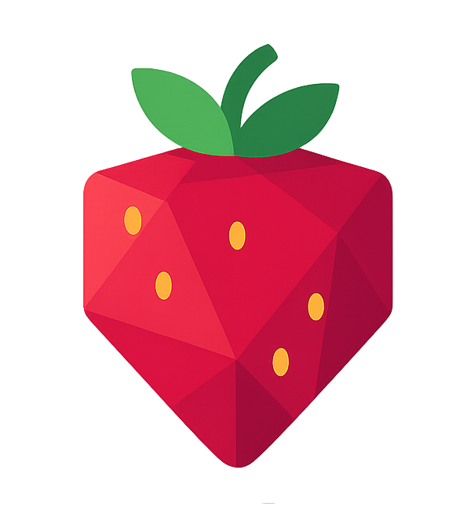

<div align="center">
  
  <h1>Strawberry Jam</h1>
  <a href='https://discord.gg/a2y6bZnhB3'>
    
  </a>
</div>

<br />

<div align="center">
A tool for exploring and extending <a href="https://classic.animaljam.com">Animal Jam Classic</a>!
<br /><br /></div>

## 🍓 What's Different from the Original Jam?

Strawberry Jam is a fork of the original [Jam](https://github.com/Sxip/jam) project, with new features, plugins, and improvements not found in the original.

## 🚀 Quick Start

###  Windows
1.  Download `Strawberry-Jam-Setup.exe` from our [latest release](https://github.com/glvckoma/strawberry-jam/releases/latest)
2.  Run the installer
3.  Launch Strawberry Jam from your Start menu

## ✨ Features

*   **🔍 Network Analysis:** Watch messages between your game and AJ's servers
*   **🔌 Plugin System:** Add cool new features with plugins
*   **🖥️ Easy to Use:** Simple desktop app with everything you need

## ⚠️ Important Warning!

Using tools like Strawberry Jam might break the game's rules and result in account termination. Please be careful and use it responsibly. Neither I nor Sxip are responsible for any loss of accounts.

## Legal Notice

**Disclaimer of Liability:**
The author accepts no responsibility for any consequences arising from the use of this software, including but not limited to account suspensions, bans, data loss, or other damages. Users assume all risks associated with using this tool.

**Software Warranty:**
This software is provided "as is" without any warranties, express or implied. No guarantees are made regarding functionality, support, updates, or bug fixes. Any modifications or improvements are made solely at the author's discretion.

**Affiliation and Trademarks:**
Strawberry Jam is an independent project and is not affiliated with, endorsed by, or associated with WildWorks or any related entities. All game assets, trademarks, and service marks belong to their respective owners.

**Redistribution Requirements:**
Any redistribution, modification, or derivative work must include clear attribution to the original author with a direct link to the source repository. Commercial use, sale, or hosted services using this software are strictly prohibited without explicit written permission.

**Prohibited Uses:**
This software must not be used for unauthorized access attempts, credential validation, account checking, or any activities that violate terms of service or compromise user security. It is intended solely for educational purposes and understanding network protocols.

**Licensing:**
Strawberry Jam is licensed under the PolyForm Noncommercial License 1.0.0, which permits noncommercial use, modification, and sharing while prohibiting commercial, production, or hosted deployment. Review the LICENSE file for complete terms.

**Takedown Procedure:**
WildWorks or its authorized representatives may request project removal by opening an issue in this repository. Upon verification of authority, the project will be taken down promptly.

## 👩‍💻 For Developers

Want to run Strawberry Jam from its source code, make your own changes, or create plugins? Here's how to get started:

1.  **Install [Node.js](https://nodejs.org):** You'll need Node.js to run the project and manage its components.
2.  **Get the Code:**
    *   Open your terminal or command prompt.
    *   Use git to clone the repository (download the code):
        ```bash
        git clone https://github.com/glvckoma/strawberry-jam.git
        ```
    *   Navigate into the project directory:
        ```bash
        cd strawberry-jam
        ```
3.  **Install Dependencies:**
    *   This command downloads all the necessary bits and pieces the project relies on:
        ```bash
        npm install
        ```
4.  **Run in Development Mode:**
    *   To run the application for development (e.g., to test changes as you make them):
        ```bash
        npm run dev
        ```
5.  **Build for Distribution (Optional):**
    *   If you want to create a packaged version of the application (like the `.exe` installer or a version for Mac/Linux) that you can share or install:
        ```bash
        npm run build
        ```
    *   This will create the distributable files in a `dist` or `release` folder (the exact location might vary based on configuration).
